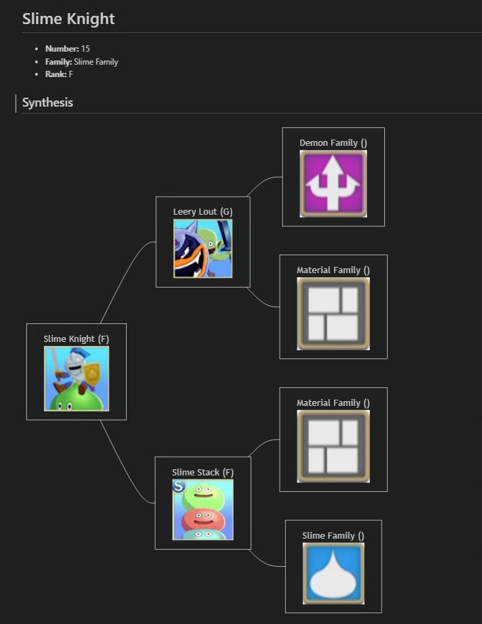

# Dqm3.MonsterTreeMarkdown

A PowerShell utility that turns Game8's Dragon Quest Monsters 3 synthesis data into shareable Markdown. Feed it a monster name and it builds a mermaid-powered family tree, complete with portrait downloads, so you can visualize how to scout or fuse toward that monster.

## Highlights

- Pulls the official Game8 structural mapping dataset for Dark Prince monsters.
- Scrapes each monster page for rank, family, number, and portrait imagery.
- Builds a mermaid `graph LR` diagram describing every parent combination leading to the requested monster.
- Writes a ready-to-publish Markdown file alongside an `images/` folder of cached artwork.
- Caches third-party packages and JSON data locally for faster repeat runs.

## Example Output



## Prerequisites

- PowerShell 7+ (Windows PowerShell 5.1 also works but 7+ is recommended).
- Internet access to reach Game8 and NuGet (the script downloads HtmlAgilityPack on first run).
- Permission to create `.cache/` and `images/` directories under the chosen output path.
- Visual Studio Code is recommended for previewing Markdown. Install the `Markdown Preview Mermaid Support` extension to display Mermaid diagrams correctly.

## Usage

Run the script from the repository root (or anywhere you have the `.ps1` file):

```powershell
pwsh .\Dqm3-GenerateMonsterTree.ps1 -MonsterName "Slime Knight" -OutputDirectory .\output -Overwrite
```

### Parameters

- `-MonsterName` *(required)*: Exact monster name as listed on Game8.
- `-OutputDirectory`: Destination for the Markdown file and `images/` folder. Defaults to the current directory.
- `-Overwrite`: Allow regeneration when the target Markdown file already exists.

### What you get

- `<OutputDirectory>/<monster-name>.md` with monster metadata and a mermaid synthesis tree.
- `<OutputDirectory>/images/` containing portrait JPGs for every monster in the tree.
- `.cache/` beside the script storing the HtmlAgilityPack package and the downloaded mapping JSON (deleted automatically on refresh).

## Tips

- Monster names must match Game8's capitalization and punctuation. If the script cannot locate the monster, verify the spelling on their site.
- Delete `.cache/dqm3_mapping.json` to force a fresh download of the mapping dataset on the next run.
- Mermaid diagrams render natively on platforms like GitHub and GitLab; other viewers may need a Mermaid plugin.

## Credits

- Script vibe-coded by Codex.
- Special thanks to [Game8.co](https://game8.co/games/DQM-Dark-Prince)
- HtmlAgilityPack project for the HTML parser

## License

Released to the public domain under the [Unlicense](LICENSE).
